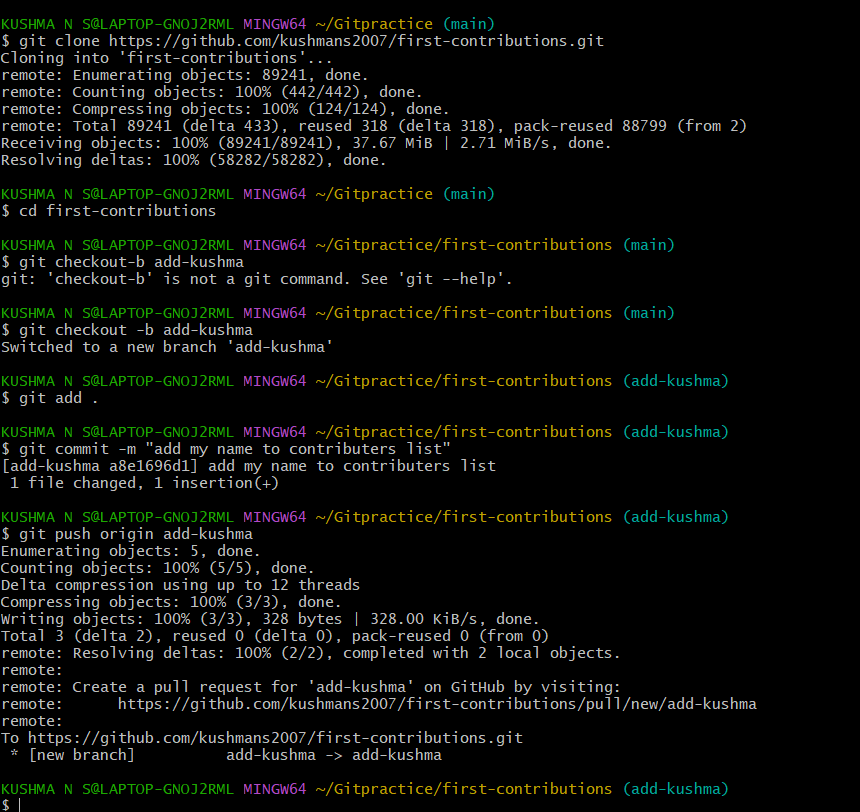
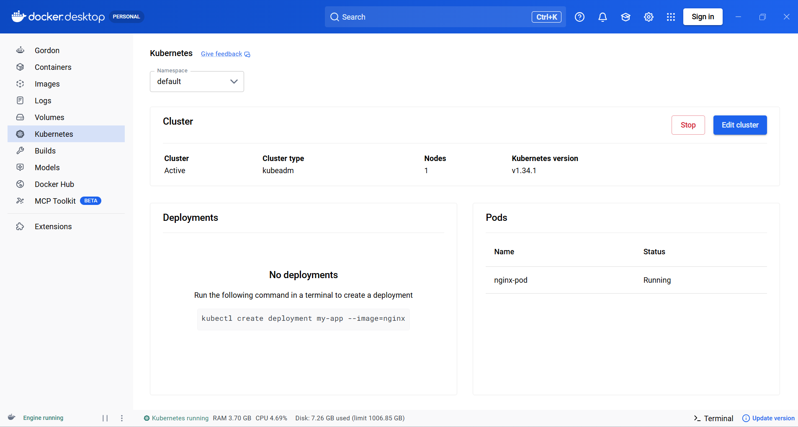

# LEVEL 1 
# Cloud Computing 
## TASK 1: Working with Git and GitHub Basics
Version Control is a system that records and manages changes made to files over time, allowing you to track modifications, collaborate with others, and restore previous versions when needed.  
The two main types are:

1 Centralized Version Control System (CVCS): In a Centralized Version Control System, there is one central server that stores the entire project and its history.

2 Distributed Version Control System (DVCS): In a Distributed Version Control System, every developer has a complete copy of the repository, including all files and history.    

A branch is an independent line of development in Git.It allows developers to work on new features, bug fixes, or experiments without affecting the main codebase.
 
```
Create Branch : git checkout -b feature
      ↓
Make Changes
      ↓
Commit : 
git add .
git commit -m "Added new feature"

      ↓
Push Branch : git push -u origin feature-login
      ↓
Open Pull Request
      ↓
Merge into Main
```  
Git Rebase: Git Rebase is a command that moves  your branch's commits on top of another branch, creating a cleaner and more linear commit history. 
``` 
# Switch to feature branch
git checkout feature-login

# Update feature branch with latest main
git rebase main

# Resolve conflicts if any
git add .
git rebase --continue

# Push updated history
git push --force-with-lease
```  
git cheery-pick is a Git command that copies a specific commit from one branch and applies it onto another branch.  


## TASK 2 : Exploring Docker Fundamentals  
Virtual Machines virtualize the entire hardware and run their own operating system, while Containers share the host operating system and only package the application with its dependencies.  
Features|Virtual Machine  |     Container   
----|------|-----
Architecture|| 
OS|has its own OS |shares host OS kernel
Isolation|Full OS isolation |Process-level isolation
Size|Large(GBs)|Small(MBs)  

Docker CLI Commands :  
 * Pull Images from Docker Hub : docker pull nginx:1.22-alpine  
* Run Containers : docker run nginx:1.22-alpine
* Run a container in background (detached mode): docker run -d nginx:1.22-alpine
* Run and expose port: docker run -d --name mynginx -p 8080:80 nginx:1.22-alpine
* List running containers: docker ps
* View processes inside a container: docker top mynginx
* Dispaly logs: docker logs mynginx
* Inspect detailed information: docker inspect mynginx
* Start Container : docker start mynginx
* Stop Container : docker stop mynginx
* Restart Container : docker restart mynginx
* Remove Container : docker rm mynginx  
  
## TASK 3 : Dockerize a Simple Application
Dockerfile: It is a text document that contains commands to assembel an Dockerimage .  
A Docker image is a packaged application along with everything it needs to run (code, libraries, dependencies, configuration).  
A base image is the starting point for building a Docker image.   
Dockerfile Directives :  
* FROM: Specifies the base image.
* WORKDIR: Sets the working directory inside the container.
* COPY: Copies files from the host machine to the image.
* RUN: Executes commands while building the image
* CMD: Specifies the default command when the container starts.  

Each Dockerfile instruction adds a snapshot of changes on top of the previous image state, and Docker builds the final filesystem by stacking those snapshots together  
* docker history  image-name:  helps visualize how layers were created

```
# Build image: docker build -t mywebapp .
# View image: docker images
# Run container: docker run -d --name webcontainer -p 8080:80 mywebapp
# Check running containers: docker ps
# View logs: docker logs webcontainer
# View image layers: docker history mywebapp
# Stop container: docker stop webcontainer
# Remove container: docker rm webcontainer
# Remove image: docker rmi mywebapp
```    

 
## TASK 5: Kubernetes Basics and Writing Pod Specs
In this task, I learned the basic concepts of Kubernetes, including Clusters, Nodes, Pods, and the Control Plane.  
* Kubernetes is an open-source platform that automates the deployment, management, scaling, and monitoring of containerized applications across a cluster of machines.  
* A Kubernetes Cluster is a group of one or more machines (called nodes) that work together to run and manage containerized applications.  
* A Node is a physical or virtual machine in a Kubernetes cluster where Pods are executed. Nodes provide the CPU, memory, and storage needed to run applications.  
* A Pod is the smallest deployable unit in Kubernetes. It contains one or more containers that share the same network and storage resources.  
* The Control Plane is the management component of Kubernetes. It schedules Pods, monitors the health of the cluster, manages resources, and ensures that the cluster remains in the desired state. 

I created a Pod manifest file (nginx-pod.yaml) using YAML to deploy an Nginx container. Using Docker Desktop's Kubernetes cluster and kubectl commands, I deployed the Pod, verified that it was running successfully, inspected its details, and viewed its logs. This task provided hands-on experience in deploying and managing containers using Kubernetes.
.png)  



# Cybersecurity
## TASK 1 : Fundamentals of Computer Networking :Introduction
A network is a group of things connected together to share information or resources.  
A computer network can be as small as 2 devices or as massive as billions of devices  
Networks are essential for services like communication, social media, traffic control, weather monitoring, and cybersecurity.
## TASK 2: Fundamentals of Computer Networking: Internet 
The Internet began in the late 1960s with ARPANET, a network funded by the U.S. Defense Department.  
In 1989, Tim Berners-Lee created the World Wide Web (WWW)  
Types of Networks:  
1. Private Network : A private network is a network that is restricted to a specific group of users or devices.  
 eg : A school's computer network ,
A company's internal network
2. Public Network : A public network is open to anyone who has access to it. The largest public network is the Internet  
eg : social media platforms, and online shopping sites 
## TASK 3: Fundamentals of Computer Networking :IP Address
For devices to communicate properly on a network, they must be identifiable :   
IP Address (Like a Name ) :    
An IP address is a temporary address that identifies a device on a network so data can be sent to the correct device.  
It is made up of four sets of numbers (e.g., 192.168.1.10)   

Types of IP Addresses  :  
1. Private IP Address – Used inside a home, school, or office network.  
Devices use this to talk to each other internally   
2. Public IP Address – Used on the Internet and provided by your ISP.
Multiple devices in a home usually share one public IP address.  

IPv4 vs IPv6  
IPv4  supports about 4.3 billion addresses.
Since the world has more devices than that, IPv6 was created.
IPv6 provides an enormous number of addresses, solving the shortage problem.  

MAC Address (Like a Fingerprint) :   
A MAC address is a unique identifier built into a device's network card by the manufacturer.  
Example: a4:c3:f0:85:ac:2d  
Usually stays the same for the device.
The first half identifies the manufacturer.
The second half identifies the specific device.  

MAC Spoofing : 
MAC spoofing means changing or faking a device's MAC address.  

## TASK 4: Fundamentals of Computer Networking : Ports
Ports are points where data enters and leaves a device. Ports are numbered communication channels.  
 In networking, ports control what kind of data can enter or leave a device. If the data isn’t compatible with a port, the connection won’t work.  
 Once a connection is established , all data sent or received travels through ports.In computers, ports are numbered from 0 to 65535.  
 Ports between 0 and 1024 are called well-known (common) ports  
 |Protocol  |	Port	|Purpose|
 |-----|------|-----|
FTP	|21	|    File transfer between client and server
SSH|	22	|Secure text-based remote login
HTTP	|80|	Regular web browsing
HTTPS|	443	|Secure web browsing (encrypted)
SMB	|445|	File and printer sharing
RDP|	3389	|Remote desktop access (graphical login)
UDP| 11211|Memcached DDoS amplification attacks
LDPA| 389 |sends data in plain text unless it is upgraded to use STARTTLS  
## TASK 5: Fundamentals of Computer Networking : Packets and Frames
Packets and frames are small units of data used in network communication.  
A packet belongs to the Network Layer (Layer 3) and contains IP information and data.  
A frame belongs to the Data Link Layer (Layer 2) and encapsulates the packet with MAC addresses.  
This process of wrapping data inside another layer is called encapsulation.  
Large messages are divided into packets, sent separately, and reassembled at the destination.
|Header	|Description|
|---|--|
Time To Live (TTL)|	Limits how long a packet can exist on the network. If it takes too long, it is discarded to prevent network congestion.
Checksum	|Verifies data integrity. If the data changes during transmission, the checksum will not match and the packet will be considered corrupted.
Source Address	|The IP address of the device that sent the packet.
Destination Address	|The IP address of the device that should receive the packet.
## TASK 6: Networking Devices
Switch:   
* Connects devices within a LAN.  
* Operates mainly at OSI Layer 2 (Data Link Layer).  
* Uses MAC addresses for forwarding data.  
* Sends data only to the intended device.  
* Improves network performance, security, and efficiency.  
* Uses packet switching to transmit data in small packets.  

Access Point (AP):  
* Provides wireless access to a wired LAN.  
* Operates at OSI Layer 1 (Physical) and Layer 2 (Data Link).  
* Acts as a bridge between wired and wireless networks.  
* Supports multiple wireless devices simultaneously.  
* Modern APs support technologies like
Wi-Fi 6 (802.11ax) for faster and more efficient communication,MU-MIMO (Multi-User Multiple Input Multiple Output) to serve multiple devices at the same time.  

Hub:  
* Connects multiple devices within a LAN.
* Operates at OSI Layer 1 (Physical Layer).
* Broadcasts data to all connected devices.
* Does not use MAC or IP addresses to forward data.
* Functions as a multiport repeater.
* Supports half-duplex communication.  

Router:
* Connects different networks and enables internet access.
* Forwards packets based on IP addresses.
* Uses routing tables to determine the optimal path.
* Supports NAT, DHCP, VPN, firewall, and QoS.
* Essential for communication between LANs and WANs.

Firewall:   
* Monitors and filters incoming and outgoing network traffic
Acts as a security barrier between trusted and untrusted networks.
* Filters traffic based on security policies.
* Prevents unauthorized access and cyber threats.
* Modern NGFWs offer DPI, application awareness, and real-time threat detection.
* Can be implemented as hardware, software, or cloud-based firewalls.   
 
Intrusion Detection and Prevention System (IDPS): 
* IDPS combines the features of IDS and IPS.
* IDS (Detection): Passive monitoring and alert generation.
* IPS (Prevention): Active monitoring and automatic threat blocking.
*  Helps protect networks from cyberattacks and unauthorized access.
* Provides real-time monitoring, detection, and prevention of security threats.  

Virtual Private Network (VPN):  
* Creates a secure, encrypted tunnel for data transmission.
* Protects data from eavesdropping and unauthorized access.
* Enables secure remote access to private networks.
* Securely connects multiple branch offices.
* Supports Multi-Factor Authentication (MFA) for enhanced security.
* Ensures privacy, confidentiality, and data integrity.

 Multilayer Switch:  
* Combines switching (Layer 2) and routing (Layer 3) in one device.
* Forwards data using MAC addresses and routes packets using IP addresses.
* Performs inter-VLAN routing without a separate router.
* Uses ASIC hardware for high-speed, wire-speed processing.
* Supports Quality of Service (QoS) to prioritize important traffic.
* Enhances network performance, scalability, and security.  
## TASK 7: DNS – Domain Name System: 
DNS acts like the "phonebook of the Internet", allowing users to access websites using easy-to-remember names instead of numerical IP addresses.  
How DNS Works (Simple Flow):  
* User enters a domain name (e.g., www.example.com).
* Browser and OS check their DNS cache.
* If not found, the request goes to the DNS Resolver.
* The resolver queries the Root DNS Server.
* The Root Server points to the TLD Server.
* The TLD Server points to the Authoritative DNS Server.
* The Authoritative Server returns the website's IP address.
* The browser connects to the web server using the IP address and loads the website. 
## TASK 8: DHCP 
* DHCP is an application-layer protocol that automatically assigns network settings such as IP address, subnet mask, default gateway, and DNS server to devices.
* It uses UDP, with the server on port 67 and the client on port 68.
* DHCP eliminates the need for manual network configuration and helps prevent IP address conflicts.
* The DHCP process follows DORA: Discover → Offer → Request → Acknowledge.
I* nitially, the client has no IP address, so it sends a broadcast request (0.0.0.0 → 255.255.255.255) to find a DHCP server.
* After the DHCP process completes, the device receives all required network settings and can connect to the Internet automatically.
## TASK 9: ICMP
* ICMP (Internet Control Message Protocol) is used for network diagnostics and error reporting.
*Ping uses ICMP to check if a host is reachable and measures Round-Trip Time (RTT).
* Ping sends an Echo Request (Type 8) and receives an Echo Reply (Type 0).
* Traceroute (tracert) uses ICMP to discover the path (hops) packets take to a destination.
* It works by using the TTL (Time-To-Live) value, with routers sending ICMP Time Exceeded (Type 11) messages.
Traceroute shows each router's IP address and the delay at every hop.
## TASK 10: HTTP(S)
* HTTP (HyperText Transfer Protocol) is an application-layer protocol used for communication between a web browser (client) and a web server.  
* HTTP follows a Request–Response model: the browser sends an HTTP request, and the server sends back an HTTP response containing the requested webpage or data.
* Common HTTP methods include:

  * GET – Retrieve data  
  * POST – Send/Create data  
  * PUT – Update an entire resource  
  * PATCH – Update part of a resource  
  * DELETE – Remove a resource  
* HTTPS (HyperText Transfer Protocol Secure) is the secure version of HTTP that uses TLS/SSL encryption to protect communication between the client and server.  
* HTTPS provides three major security features:

  * Confidentiality – Encrypts data
  * Authentication – Verifies the website using a digital certificate
  * Integrity – Ensures data is not altered during transmission

## TASK 11:OSI (OPEN SYSTEM INTERCONNECTION)
* The OSI Model is a conceptual framework that explains how data is transmitted between devices over a network using seven layers, with each layer performing a specific function.
* The Physical Layer (Layer 1) is responsible for transmitting raw bits through physical media such as cables, fiber optics, or wireless signals.
* The Data Link Layer (Layer 2) organizes bits into frames, provides error detection, and uses MAC addresses to deliver data between devices on the same network.
* The Network Layer (Layer 3) handles routing of data across multiple networks using IP addresses. The Internet Protocol (IP) operates at this layer.
* The Transport Layer (Layer 4) ensures end-to-end communication. TCP provides reliable, ordered, and error-checked delivery, while UDP offers faster but less reliable communication.
* The Application, Presentation, and Session Layers (Layers 5–7) support user applications, data formatting, encryption, compression, and communication management. In practice, these layers are often combined.
* Importance of the OSI Model: Although it is mainly used for education, the OSI model helps in understanding network communication, troubleshooting issues, and classifying networking devices such as Layer 4 (L4) and Layer 7 (L7) load balancers.  
## TASK 12: Windows: Introduction
* Windows File Management: Windows uses File Explorer to organize files and folders, making it easy to store, access, and manage data efficiently.
* System Maintenance: Regular Windows updates improve security, fix bugs, and enhance system performance, keeping the computer stable and protected.
* Application Management: Applications should be installed only from trusted sources, kept updated, and uninstalled when no longer needed to maintain security and performance.
* System Monitoring and Settings: Windows Settings, Control Panel, and Task Manager help users configure system options, monitor resource usage, and troubleshoot performance issues.
## TASK 13:Windows: Powershell
* PowerShell is a cross-platform command-line shell and scripting language developed by Microsoft to automate tasks, manage systems, and configure devices efficiently.
* Unlike the traditional Command Prompt, PowerShell works with objects instead of plain text, making data processing more accurate and easier to automate.
* PowerShell is built on the .NET framework and is available on Windows, macOS, and Linux, enabling cross-platform administration.
* It is widely used by system administrators for automation, system management, and advanced scripting, helping reduce manual work and improve productivity.
## TASK 14:Windows: Powershell vs CMD
|Feature	|Command Prompt (CMD)|	PowerShell|
|-------|-----|--------|
|1. Data Handling   |  	Works with plain text output|	  Works with structured objects
|2. Scripting |	Supports basic batch (.bat) | scripts	Supports advanced PowerShell (.ps1) scripting
|3. Automation |	Limited automation capabilities	      |  Powerful automation using cmdlets and scripts
|4. Remote Administration  |	Not designed for remote system management  |	Supports remote administration of systems
|5. Platform Support |	Available only on Windows |	Available on Windows, Linux, and macOS

## TASK 15: Windows: System32
* The Windows directory (usually C:\Windows) contains the essential files required for the Windows operating system to function properly.
* Environment variables, such as %windir%, help Windows and applications locate important system folders regardless of where Windows is installed.
* The System32 folder is a critical part of the Windows directory, storing essential system files, drivers, and built-in utilities needed by the operating system.
* Users should avoid modifying or deleting files in the System32 folder, as doing so can cause system errors or make Windows unstable.
## TASK 16: Windows: User Accounts & UAC
* Windows provides two main types of user accounts: Administrator and Standard User, each with different levels of access and permissions.
* Administrator accounts can install software, manage users, change system settings, and perform other system-wide administrative tasks.
* Standard User accounts can access and manage personal files but cannot make changes that affect the operating system or other users.
* Each user has a user profile stored in the C:\Users directory, which contains personal folders such as Desktop, Documents, Downloads, Pictures, and Music.
* Local Users and Groups Management (lusrmgr.msc) allows administrators to manage user accounts, create groups, and assign permissions by adding users to different groups.
## TASK 17: Windows: Security
* Windows Security is a built-in protection system that helps safeguard the computer from viruses, malware, and other cyber threats.
* It includes features such as Virus & Threat Protection, App & Browser Control, and Device Security to enhance system safety.
* The Windows Firewall monitors and controls incoming and outgoing network traffic, preventing unauthorized access to the system.
* Windows Firewall supports Domain, Private, and Public network profiles, allowing different security levels based on the type of network being used.
## TASK 18: Linux:Introduction
* Linux is a lightweight, open-source operating system widely used in web servers, automotive systems, retail devices, and critical infrastructure because of its reliability and performance.
* Linux has many distributions (distros), such as Ubuntu and Debian, which are customized for different purposes like desktop computing and server management.
* Ubuntu is one of the most popular Linux distributions due to its user-friendly interface, flexibility, and ability to run efficiently even on systems with low hardware resources.
## TASK 19: Linux:File Systems
* Linux provides command-line tools to create, copy, move, rename, and delete files and directories efficiently.
* The touch command creates a new empty file, while the mkdir command is used to create a new directory (folder).
* The cp command copies files or directories, and the mv command is used to move files or rename them.
* The rm command permanently deletes files, and rm -R is used to delete directories and their contents recursively.
* The file command identifies the actual type of a file, regardless of its file extension, making it useful for verifying file contents.
## TASK 20:  Others: Cryptography - Part 1
* Cryptography is the practice of protecting information to ensure secure communication by maintaining confidentiality, integrity, and authenticity.
* It is widely used in applications such as online banking, HTTPS websites, SSH connections, encrypted messaging, and secure file transfers.
* Encryption converts readable plaintext into unreadable ciphertext using a cipher and a key, preventing unauthorized access.
* Decryption reverses the encryption process, converting ciphertext back into plaintext using the correct key.
* The main components of cryptography are plaintext, ciphertext, cipher, key, encryption, and decryption, which work together to secure digital information.
* Cryptography also helps organizations comply with security standards and regulations such as PCI DSS, HIPAA, and GDPR, ensuring sensitive data is protected both in storage and during transmission.
## TASK 21: Cryptography -part2 
Types of Encryption :  
* Symmetric encryption :
  * Symmetric encryption uses a single secret key for both encryption and decryption.
  * The main challenge of symmetric encryption is securely sharing the secret key between the sender and receiver.
  * Common symmetric algorithms include DES, 3DES, and AES. AES is the modern and widely used standard.
  * AES supports 128-bit, 192-bit, and 256-bit keys and provides strong security with high performance.  
* Asymmetric encryption:  
  * Asymmetric encryption uses two mathematically related keys: a public key and a private key.
  * The public key can be openly shared, while the private key must be kept secret by its owner.
  * Asymmetric cryptography is based on mathematical problems that are easy to compute in one direction but extremely difficult to reverse without the private key.
  * Common asymmetric algorithms include RSA, Diffie-Hellman, and ECC.
## TASK 23: Principles of CyberSecurity: CIA
The CIA Triad is the foundation of cybersecurity and consists of :
* Confidentiality  
* Integrity   
* Availability.

## TASK 24: Principles of CyberSecurity: CIA - Explanantion


* The CIA Triad represents the three fundamental principles of cybersecurity: Confidentiality, Integrity, and Availability.
* Confidentiality ensures that sensitive information is accessible only to authorized users and is protected from unauthorized disclosure.
* Integrity ensures that data remains accurate, complete, and trustworthy and is not improperly modified or deleted.
* Availability ensures that systems, applications, and data are accessible to authorized users whenever they are needed, even during failures or attacks.
## TASK 25: Path 1 - Red Teaming
* Offensive security involves actively testing systems, networks, and applications to identify vulnerabilities before real attackers can exploit them.
* Security professionals analyze systems from an attacker’s perspective by identifying exposed components, accessible resources, and potential weaknesses.
* Ethical hacking and penetration testing are legal and authorized activities performed to discover security vulnerabilities and help organizations fix them.
* Offensive security follows a structured methodology, where security professionals discover weaknesses, analyze their impact, and use the findings to strengthen the overall security of the system.
## TASK 26: Red Teaming Continuation
* Offensive security involves legally and safely testing systems to identify vulnerabilities before real attackers can exploit them.
* Penetration testing is an authorized security assessment used to discover and exploit weaknesses within a defined scope.
* Web enumeration involves identifying hidden or unintended pages, directories, and resources that may be accessible on a web application.
* Gobuster is an automated tool used to discover hidden directories and files by testing many possible paths from a wordlist.
* The command gobuster dir --url <target> -w <wordlist> performs directory enumeration, helping security testers identify potentially exposed web resources.
