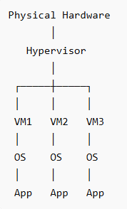
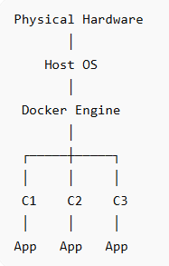
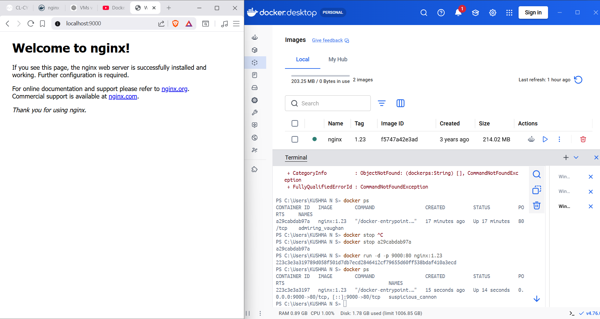
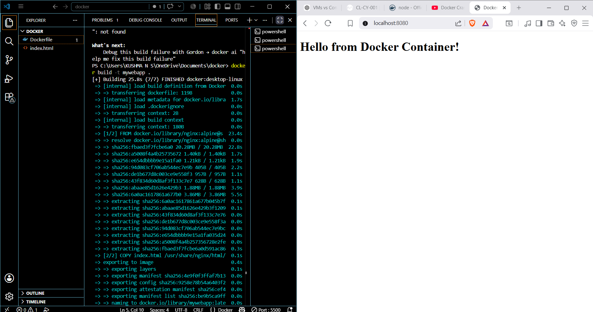

# LEVEL 1 
# Cloud Computing 
## TASK 2 : Exploring Docker Fundamentals  
Virtual Machines virtualize the entire hardware and run their own operating system, while Containers share the host operating system and only package the application with its dependencies.  
Features|Virtual Machine  |     Container   
----|------|-----
Architecture|| 
OS|has its own OS |shares host OS kernel
Isolation|Full OS isolation |Process-level isolation
Size|Large(GBs)|Small(MBs)  

Docker CLI Commands :  
 * Pull Images from Docker Hub : docker pull nginx:1.22-alpine  
* Run Containers : docker run nginx:1.22-alpine
* Run a container in background (detached mode): docker run -d nginx:1.22-alpine
* Run and expose port: docker run -d --name mynginx -p 8080:80 nginx:1.22-alpine
* List running containers: docker ps
* View processes inside a container: docker top mynginx
* Dispaly logs: docker logs mynginx
* Inspect detailed information: docker inspect mynginx
* Start Container : docker start mynginx
* Stop Container : docker stop mynginx
* Restart Container : docker restart mynginx
* Remove Container : docker rm mynginx  
  
## TASK 3 : Dockerize a Simple Application
Dockerfile: It is a text document that contains commands to assembel an Dockerimage .  
A Docker image is a packaged application along with everything it needs to run (code, libraries, dependencies, configuration).  
A base image is the starting point for building a Docker image.   
Dockerfile Directives :  
* FROM: Specifies the base image.
* WORKDIR: Sets the working directory inside the container.
* COPY: Copies files from the host machine to the image.
* RUN: Executes commands while building the image
* CMD: Specifies the default command when the container starts.  

```
# Build image
docker build -t mywebapp .

# View image
docker images

# Run container
docker run -d --name webcontainer -p 8080:80 mywebapp

# Check running containers
docker ps

# View logs
docker logs webcontainer

# View image layers
docker history mywebapp

# Stop container
docker stop webcontainer

# Remove container
docker rm webcontainer

# Remove image
docker rmi mywebapp
```  
 
# Cybersecurity
## TASK 1 : Fundamentals of Computer Networking :Introduction
A network is a group of things connected together to share information or resources.  
A computer network can be as small as 2 devices or as massive as billions of devices  
Networks are essential for services like communication, social media, traffic control, weather monitoring, and cybersecurity.
## TASK 2: Fundamentals of Computer Networking: Internet 
The Internet began in the late 1960s with ARPANET, a network funded by the U.S. Defense Department.  
In 1989, Tim Berners-Lee created the World Wide Web (WWW)  
Types of Networks:  
1. Private Network : A private network is a network that is restricted to a specific group of users or devices.  
 eg : A school's computer network ,
A company's internal network
2. Public Network : A public network is open to anyone who has access to it. The largest public network is the Internet  
eg : social media platforms, and online shopping sites 
## TASK 3: Fundamentals of Computer Networking :IP Address
For devices to communicate properly on a network, they must be identifiable :   
IP Address (Like a Name ) :    
An IP address is a temporary address that identifies a device on a network so data can be sent to the correct device.  
It is made up of four sets of numbers (e.g., 192.168.1.10)   

Types of IP Addresses  :  
1. Private IP Address – Used inside a home, school, or office network.  
Devices use this to talk to each other internally   
2. Public IP Address – Used on the Internet and provided by your ISP.
Multiple devices in a home usually share one public IP address.  

IPv4 vs IPv6  
IPv4  supports about 4.3 billion addresses.
Since the world has more devices than that, IPv6 was created.
IPv6 provides an enormous number of addresses, solving the shortage problem.  

MAC Address (Like a Fingerprint) :   
A MAC address is a unique identifier built into a device's network card by the manufacturer.  
Example: a4:c3:f0:85:ac:2d  
Usually stays the same for the device.
The first half identifies the manufacturer.
The second half identifies the specific device.  

MAC Spoofing : 
MAC spoofing means changing or faking a device's MAC address.  

## TASK 4: Fundamentals of Computer Networking : Ports
Ports are points where data enters and leaves a device. Ports are numbered communication channels.  
 In networking, ports control what kind of data can enter or leave a device. If the data isn’t compatible with a port, the connection won’t work.  
 Once a connection is established , all data sent or received travels through ports.In computers, ports are numbered from 0 to 65535.  
 Ports between 0 and 1024 are called well-known (common) ports  
 |Protocol  |	Port	|Purpose|
 |-----|------|-----|
FTP	|21	|    File transfer between client and server
SSH|	22	|Secure text-based remote login
HTTP	|80|	Regular web browsing
HTTPS|	443	|Secure web browsing (encrypted)
SMB	|445|	File and printer sharing
RDP|	3389	|Remote desktop access (graphical login)
UDP| 11211|Memcached DDoS amplification attacks
LDPA| 389 |sends data in plain text unless it is upgraded to use STARTTLS  
## TASK 5: Fundamentals of Computer Networking : Packets and Frames
Packets and frames are small units of data used in network communication.  
A packet belongs to the Network Layer (Layer 3) and contains IP information and data.  
A frame belongs to the Data Link Layer (Layer 2) and encapsulates the packet with MAC addresses.  
This process of wrapping data inside another layer is called encapsulation.  
Large messages are divided into packets, sent separately, and reassembled at the destination.
|Header	|Description|
|---|--|
Time To Live (TTL)|	Limits how long a packet can exist on the network. If it takes too long, it is discarded to prevent network congestion.
Checksum	|Verifies data integrity. If the data changes during transmission, the checksum will not match and the packet will be considered corrupted.
Source Address	|The IP address of the device that sent the packet.
Destination Address	|The IP address of the device that should receive the packet.